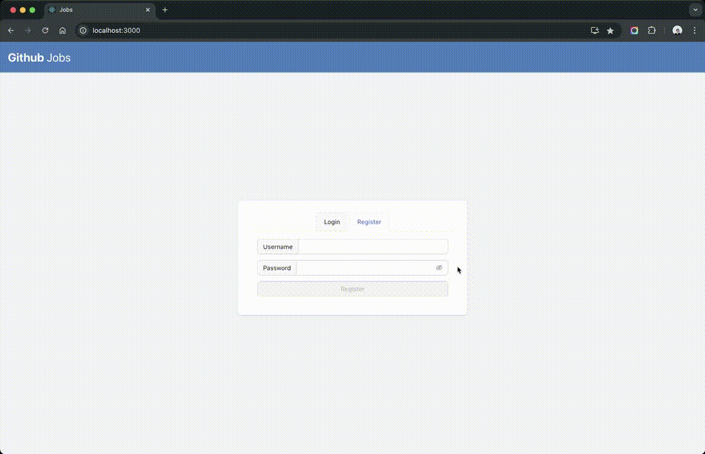

# Recruitment Page with NodeJS, MySQL, and ReactJS

### Description
The articles page is a dynamic web application built with NodeJS , MySQL, and React. The backend, powered by Express JS and MySQL to access recruitment position data. The frontend, built with React, provides a user-friendly interface to view a list of position, their details.

### Documentation
- [Backend - README](dans_be/README.md) | [Postman Collection](api.postman_collection.json)
- [Frontend - README](dans_be/README.md)




### Project Structure
```
root
├── backend  # Go-MySQL
│   ├── config
│   ├── controllers
│   ├── middlewares
│   ├── models
│   ├── routes
│   ├── app.js
│   └── ...
├── frontend  # ReactJS
│   ├── src
│   │   ├── routes
│   │   ├── store
│   │   ├── pages
│   │   ├── api
│   │   └── ...
│   ├── public
│   ├── package.json
│   └── ...
└── ...
```